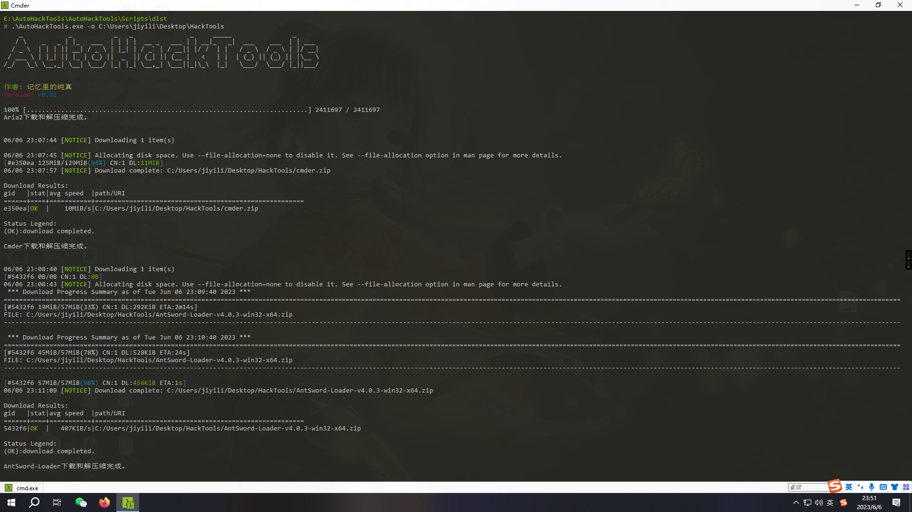
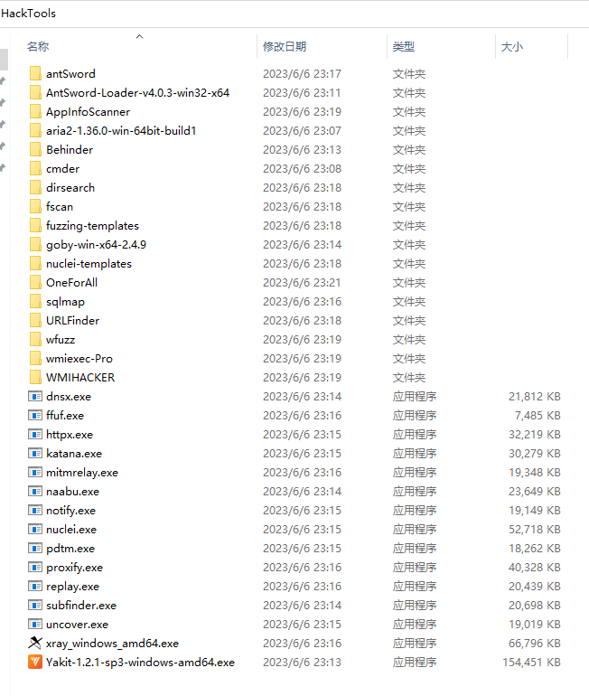

   

## AutoHackTools

AutoHackTools是一个用于快速部署常用安全渗透工具的轻量级脚本。

旨在帮助安全从业者快速搭建常用渗透测试环境，方便快速开展安全渗透测试任务，节约软件的安装部署时间，从而提升工作效率。

## 免责声明

请勿将本项目技术或代码应用在恶意软件制作、软件著作权/知识产权盗取或不当牟利等非法用途中。实施上述行为或利用本项目对非自己著作权所有的程序进行数据嗅探将涉嫌违反《中华人民共和国刑法》第二百一十七条、第二百八十六条，《中华人民共和国网络安全法》《中华人民共和国计算机软件保护条例》等法律规定。本项目提及的技术仅可用于私人学习测试等合法场景中，任何不当利用该技术所造成的刑事、民事责任均与本项目作者无关。

## 环境说明

- Python3及以上版本 (无Python 环境可以从releases页面下载打包好的EXE文件运行。)
- GitHub Token

## 使用方法

```bash
git clone https://github.com/DroidKali/AutoHackTools.git
cd AutoHackTools
python -m pip install -r requirements.txt
python AutoHackTools.py -o HackTools
```
## 参数说明

```txt
-o 指定要安装的工具目录，必填。
-t 指定GitHub Token, 未登录GitHub时，每小时只能请求60次，可能会导致部分工具下载失败，建议配置
```

## 已支持的工具列表
- AntSword
- AppInfoScanner
- Behinder
- dirsearch
- ffuf
- fscan
- goby
- OneForAll
- ProjectDiscovery Tools (全家桶)
- sqlmap
- URLFinder
- wfuzz
- wmiexec-Pro
- WMIHACKER
- xray
- Yakit

## 效果展示


